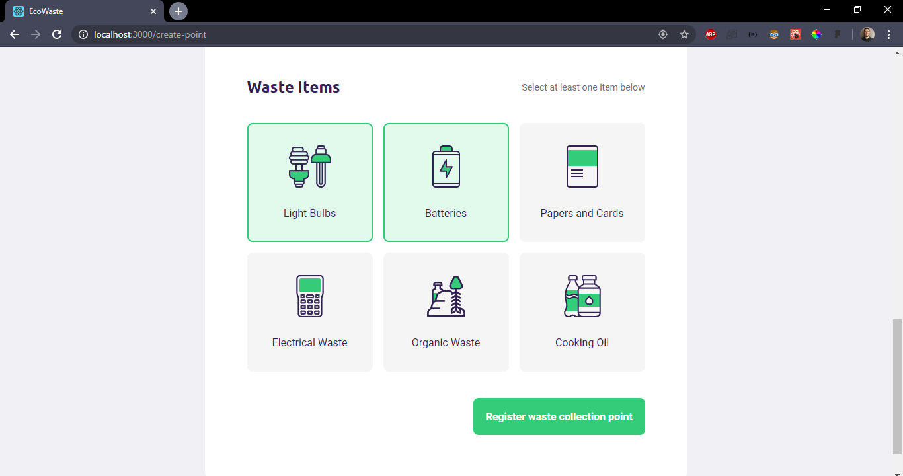

<h1 align="center">
  
</h1>

<h2 align="center">
  Next Level Week 1.0 - EcoWaste Management Application (Ecoleta)
</h2>

## :computer: / :iphone: About

Application (Web and Mobile) developed over one week training by [Rocketseat](https://rocketseat.com.br/) company using NodeJS, ReactJS, React Native and much more. </br>
Web version is intended to the owner of the places that collect waste items, and they can register his/her point and indicate the items they receive. </br> 
Mobile version is to people that want to make the righ disposal of items like ligh bulbs, papers, cooking oil and others. The user choose State/UF and city to search the places registered on the app, and can filter the places by the item(s). It's possible to see details of the point, and make contact by Email or Phone-Number.

## Features

<details><summary><b>BackEnd</b></summary>
  
- Route to Create Waste Items
- Route to Create Points
- Route to List Points
- Route to Filter Points
- Supports image upload
- ...

</details>

<details><summary><b>FrontEnd</b></summary>
  
- Image upload
- Address selection on map
- Insert State/UF and city (API that provide States and city is from Brazil)
- Selection of items
- Toast (Flag) to indicate if register was done successfully or if is missing any information
- ...

</details>

<details><summary><b>Mobile</b></summary>
  
- Selection of State/UF and city
- Permission to access user location and show on map
- Filter of collection points according to the selected item(s) by the user
- Details page (after user click on some point) with information and buttons that make possible contact by email and phone number
- ...

</details>

## Built with

<details><summary><b>BackEnd</b></summary>

- Typescript (~3.7.2)
- Node (v12.16.1)
- Yarn (1.17.3)
- Npm (6.13.4)
- Express (^4.17.1)
- Knex (^0.21.1)
- SQLite3 (^4.2.0)
- Cors (^2.8.5)
- Multer (^1.4.2)
- Celebrate": (^12.1.1)
- ...

</details>

<details><summary><b>FrontEnd</b></summary>

- React (^16.13.1)
- Typescript (~3.7.2)
- Node (v12.16.1)
- Yarn (1.17.3)
- Npm (6.13.4)
- Leaflet (^1.6.0)
- Toastify (^6.0.5)
- Dropzone (^11.0.1)
- React Icons (^3.10.0)
- Axios (^0.19.2)
- ...

</details>

<details><summary><b>Mobile</b></summary>
  
- React Native (0.62.2)
- React (16.11.0)
- Typescript (^3.8.3)
- Axios (^0.19.2)
- Geolocation (^2.0.2)
- Picker (^1.6.1)
- Vector-icons (^6.6.0)
- Splash-screen (^3.2.0)
- Maps (0.27.1)
- ...

</details>

## :framed_picture: :computer: Web Application Screens

<h3 align="center">
  


<details><summary><b>More Web Screens</b></summary>
  





</details>
</h3>

## :framed_picture: :iphone: Mobile Application Screens

<h1 align="center">


</h1>

## How to install and run <strong>EcoWaste_Web :computer:</strong>:

<details><summary><b>Server/BackEnd/API</b></summary>
  
</br>

<strong>1. Clone this project and install dependencies</strong>

```
$ git clone https://github.com/jvictor-am/eco_waste_management.git
$ cd eco_waste_management/server
$ npm install
or
$ yarn install
```

<strong>2. Run Migrations</strong>

```
$ npm run knex:migrate
or
$ yarn knex:migrate
```

<strong>3. Run Seeds</strong>

```
$ npm run knex:seed
or
$ yarn knex:seed
```

<strong>4. Start server</strong>

```
$ npm run dev
or
$ yarn dev
```

</details>

<details><summary><b>Web Application/FrontEnd</b></summary>
  
</br>

<strong>1. Open in another terminal the web directory (server must be running). Something like below:</strong>

```
$ cd eco_waste_management/web
```

<strong>2. Install dependencies</strong>

```
$ npm install
or
$ yarn install
```

<strong>3. Run on localhost:3000</strong>

```
$ npm start
or
$ yarn start
```

</details>

## How to install and run <strong>EcoWaste_Mobile :iphone:</strong>:

<details><summary><b>Server/BackEnd/API</b></summary>
  
</br>

<strong>1. Same procedures as described above on EcoWaste_Web</strong>

</details>

<details><summary><b>Mobile application</b></summary>
  
</br>

<details><summary><b>0. Before begin we have some considerations:</b></summary>

</br>

- App is working smoothly on physical device and Emulator - both Android.
- If you try on IOS systems, you may need to do further configuration (like to use splash screen, to use Google Maps - API_KEY) than the ones we will describe below (Sorry, I don't have MAC computer yet)

</details>

<strong>1. Open in another terminal the mobile directory (server must be running). Something like below:</strong>

```
$ cd eco_waste_management/mobile
```

<strong>2. Install dependencies</strong>

```
$ npm install
or
$ yarn install
```

<strong>3. Need configure API_KEY to use Google Maps on AndroidManifest.xml file</strong>

<strong>4. Run</strong>

```
$ yarn android
```

<strong>4. Run</strong>

```
$ yarn start
```

</details>

</br>

---

# Author

[**João Victor**](https://www.linkedin.com/in/jo%C3%A3o-victor-de-andrade-mesquita-848a09122/)

<h2 align="center">
  Thank You!
</h2>
